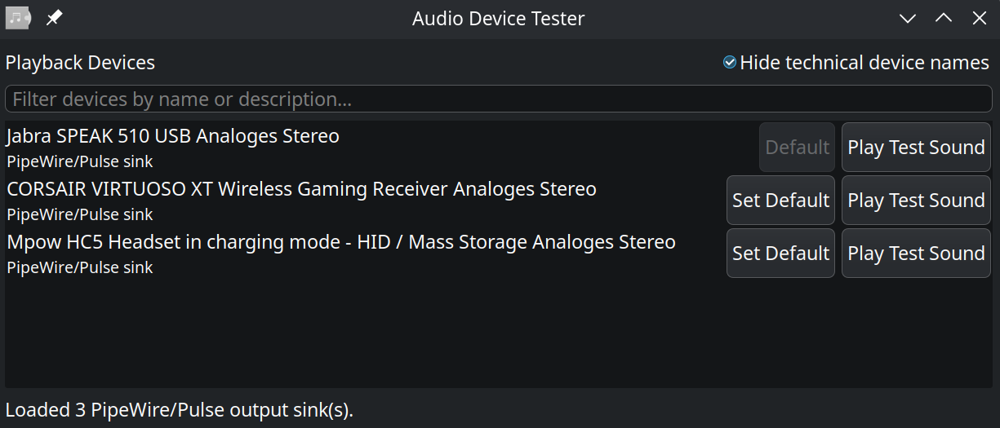

# Audio Device Tester (openSUSE Leap 16.0)

Minimal desktop GUI to enumerate playback devices and play a short test tone on each one.

## Screenshot



## Goals

- Simple GUI for audio output testing.
- Keep dependencies minimal and system-native.
- Produce a single executable (`audio-device-tester`).

## Stack

- Language: C11
- GUI: GTK 3
- Audio API: ALSA
- Build system: CMake

## Build (openSUSE Leap 16.0)

Install build dependencies:

```bash
sudo zypper install -y gcc cmake make pkg-config gtk3-devel alsa-lib-devel
```

Build:

```bash
cmake -S . -B build
cmake --build build -j
```

Run:

```bash
./build/audio-device-tester
```

## Notes

- Device enumeration uses ALSA PCM hints and shows output-capable entries.
- A `Hide technical device names` checkbox is enabled by default, so the list prefers human-readable labels.
- The test button plays a 1-second 880 Hz sine tone.
- This is an MVP foundation. Next iterations can add PipeWire/Pulse-aware testing, non-blocking playback, and better device labels.
